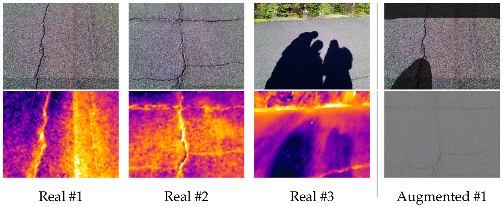
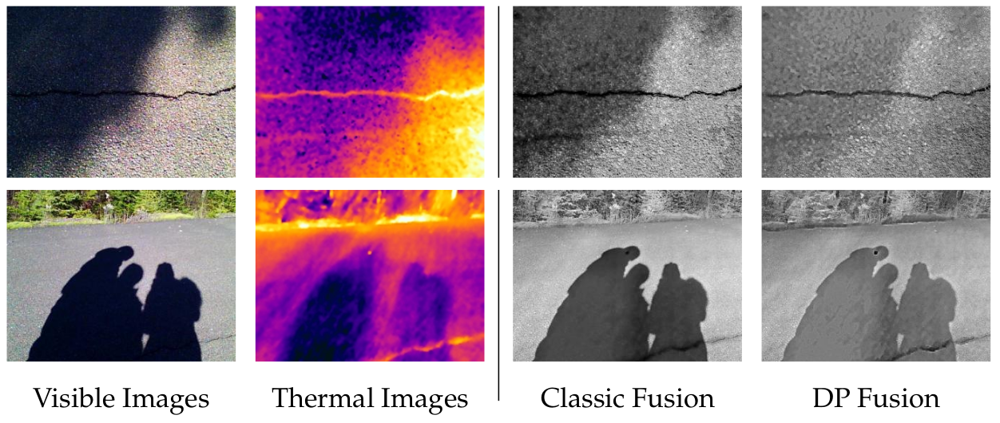
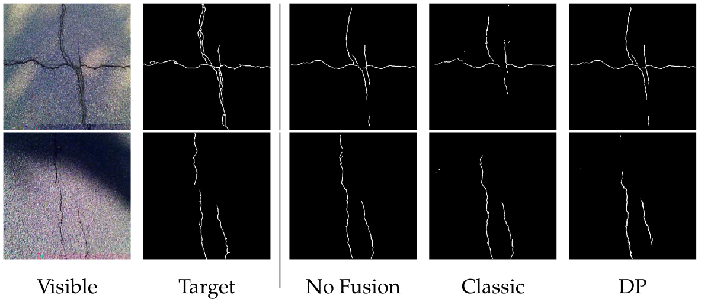
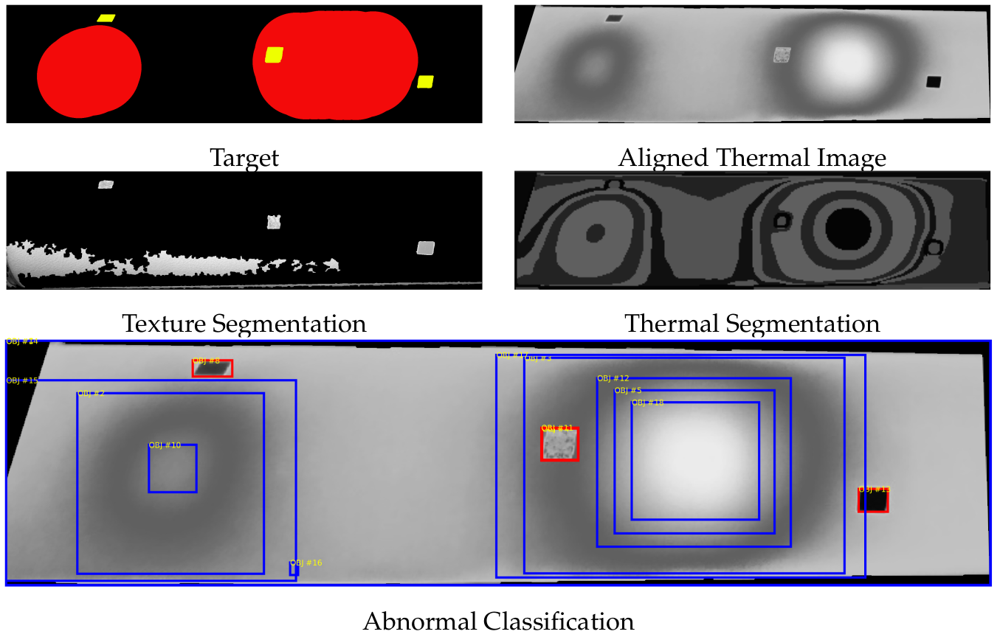
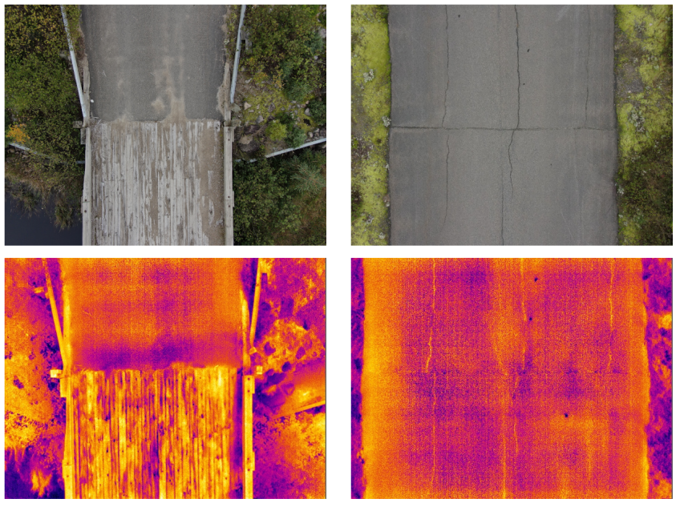
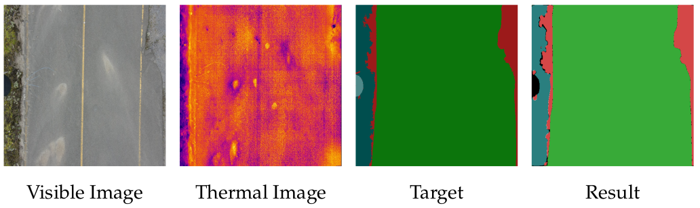
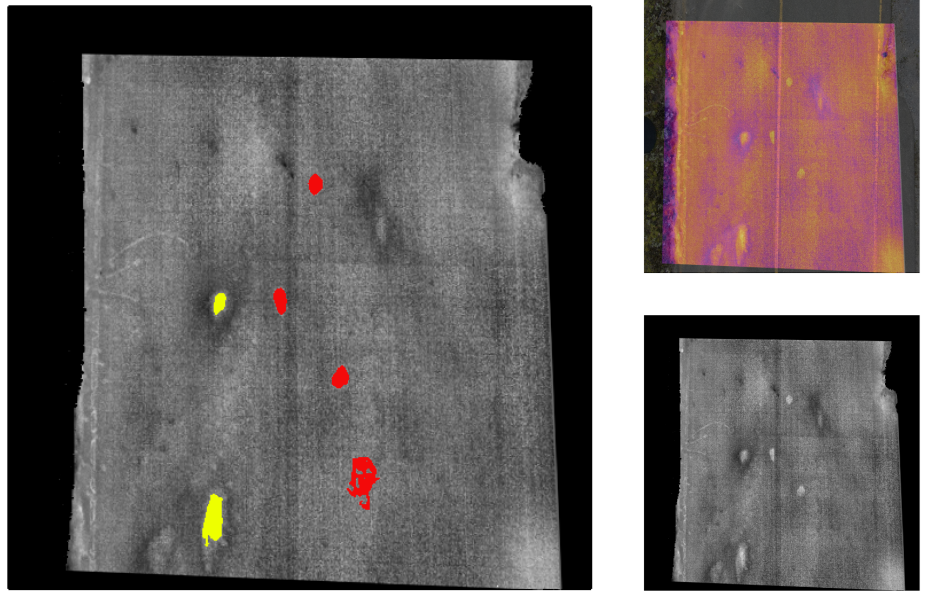
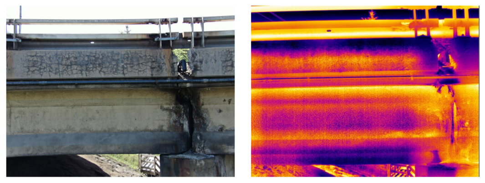
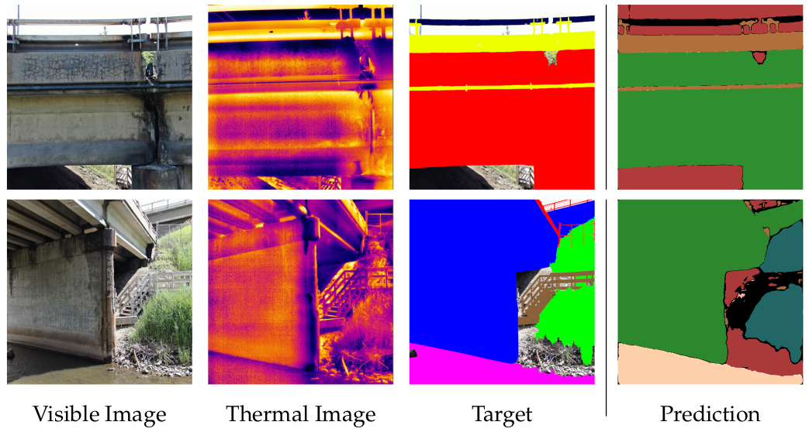
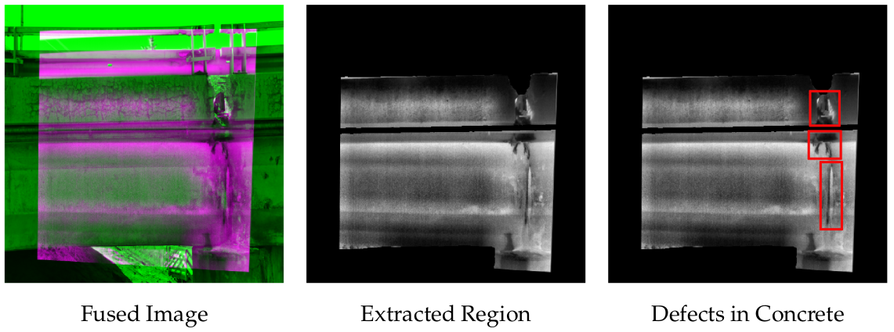

<!-- PROJECT LOGO -->
<br />
<p align="center">
  <a href="https://www.ulaval.ca/en/" target="_blank">
    
  </a>

  <h3 align="center">LeManchot-Analysis</h3>

  <p align="center">
	The Analysis subsystem of the LeManchot platform provides the required tools for fusion of thermal and visivle modalities. Also it provides the required features to detect the defects and abnormalities using both modalities.
    <br/>
    <br/>
  </p>
</p>

# LeManchot-Analysis

Remote thermographic inspection of industrial and construction components is a relatively new field of research with growing interest among researchers and companies, especially in the light of recent advancements in Unmanned Aerial Vehicles (UAVs). Due to the unique capabilities of drones to carry a wide range of sensors as payload and facilitate data acquisition through their maneuver abilities, collecting synchronized multi-modal data has become a possibility in terms of cost and time. In addition, using multiple sensors can significantly enhance the analysis result and provide a more accurate assessment of the components' operability and structural integrity. Complementary modalities oblige companies to build automated process pipelines that can avoid data misinterpretation and deliver more precise and comprehensive evaluations, which is one of the objectives of NDT4.0. In this paper, we investigate the applications of texture-based segmentation of visible modality to enhance thermal analysis in a drone-based multi-modal inspection. The proposed process pipeline texturally segments the visible images and uses the result to improve the detection and characterization of possible abnormalities in thermal images. Moreover, we introduced four case studies with different process pipelines and datasets to demonstrate the presented approach's benefits in various industrial applications.

**Keywords** `Multi-Modal Data Processing`  `Unmanned Aerial Vehicle`   `Texture Segmentation`   `Remote Inspection`   `Thermography`   `Thermal Image Segmentation`

## Usage

For setting the path for system settings you need to initialize system environment variable: 

``` $ export LEMANCHOT_VT_SETTING_PATH = [ADD YOUR PATH HERE] ```
For the system to be able to load the experiment configuration, you need to initialize configuration dir path:
``` $ export LEMANCHOT_VT_CONFIG_DIR = [CONFIG DIR] ```

## Use Cases

This section includes four use cases of employing coupled thermal and visible cameras aiming toward the enhancement of post-analysis during a drone-based automated process pipeline in different inspection scenarios in different industries. The **Use Case 1** explains the benefits of fusing visible images with thermal images to enhance the defect detection process. **Use Case 2** explains the multi-modal approach for abnormality classification in piping inspection. Employing visible images to extract the region of interest in thermal images to enhance the drone-based thermographic inspection of roads is described in **Use Case 3**. Finally, a drone-based inspection of concrete bridges using coupled thermal and visible cameras is investigated in **Use Case 4**.

### Case Study 1 : Enhance Visual Inspection of Roads using Coupled Thermal and Visible Cameras 

One of the applications for coupled thermal and visible sensors is to enhance defect detection in visual inspection using thermal images in case of illumination or contrast issues. This section presents a process pipeline for automatic crack detection using coupled thermal and visible images. The objective is to demonstrate the effect of the Thermal-Visible image fusion on crack detection in typical- and worst-case scenarios. The worst-case scenario occurs when shadows, low illumination, or low contrast disrupt the detection process.

<p align="center">
  
</p>

<p align="center">
  
</p>

<p align="center">
  
</p>

### Case Study 2 : Abnormality Classification using Coupled Thermal and Visible Images

Another area in which coupled thermal and visible images can be beneficial is remote inspection when physical access is limited. In such scenarios, comprehensive information in different modalities is needed to avoid data misinterpretation. In the case of thermographic inspection, the abnormalities are recognizable in thermal images, and several methods exist that can semi-automate the detection process. However, distinguishing between surface and subsurface defects is hard or impossible with only thermal information in an automated process pipeline. To address this challenge, coupled thermal and visible images can be employed to enhance the classification process. In this use case, thermal and visible images are used to classify detected defects into surface and subsurface abnormalities using texture analysis.

<p align="center">
  
</p>

### Case Study 3 : Enhance the Analysis of Drone-based Road Inspection using Coupled Thermal and Visible Images

In this use case, the use of visible images for helping to extract the region of interest in thermal images is investigated comprehensively for drone-based inspection of road pavement. 

<p align="center">
  
</p>

<p align="center">
  
</p>

<p align="center">
  
</p>

### Case Study 4 : nhance the Analysis of Bridge Inspection using Coupled Thermal and Visible Images

This use case investigates the use of coupled thermal and visible cameras to enhance the drone-based thermographic inspection of concrete bridges.

<p align="center">
  
</p>

<p align="center">
  
</p>

<p align="center">
  
</p>


## Citation

.... the paper will be publish soon!

## Contributors

**Parham Nooralishahi** - parham.nooralishahi@gmail.com | [@phm](https://www.linkedin.com/in/parham-nooralishahi/) <br/>
**Gabriel Ramos** - gabriel.ramos.1@ulaval.ca | [@gabriel](https://www.linkedin.com/in/gramos-ing/) <br/>
**Sandra Pozzer** - sandra.pozzer.1@ulaval.ca | [@sandra](https://www.linkedin.com/in/sandra-pozzer/) <br/>

## Team

**Parham Nooralishahi** is a specialist in embedded and intelligent vision systems and currently is a Ph.D. student at Universite Laval working on developing drone-enabled techniques for the inspection of large and complex industrial components using multi-modal data processing. He is a researcher with a demonstrated history of working in the telecommunication industry and industrial inspection and in-depth expertise in robotics & drones, embedded systems, advanced computer vision and machine learning techniques. He has a Master’s degree in Computer Science (Artificial Intelligence). During his bachelor's degree, he was involved in designing and developing the controlling and monitoring systems for fixed-wing drone for search and rescue purposes. Also, during his Master's degree, he worked extensively on machine learning and computer vision techniques for robotic and soft computing applications.

**Gabriel Ramos** received his Bachelor's degree in Mechanical Engineering (B.Eng.) from Universit\'e Laval, Quebec, Canada in 2017. 
During his bachelor's degree and his early career, he specialised in numerical structural, modal, and thermal simulations, data analysis and mechanical systems design. He is currently a student in the department of Computer Science and Software Engineering at Universit\'e Laval, where he is pursuing his Master's degree in Artificial Intelligence with a focus on computer vision for robotics.

**Sandra Pozzer** received his Bachelor's degree in Civil Engineering (B.Eng.) from the University of Passo Fundo, Brazil (2016). During his bachelor's degree, she specialized in transportation Infrastructure, including one year of applied studies at the Università Degli Studi di Padova, Italy (2013-2014). During her Master's studies, she studied infrared thermography applied to the inspection of concrete structures at the University of Passo Fundo, Brazil ( 2020), including one term of applied research at Lakehead University, Ontario, Canada in 2019. Currently, she is a Ph.D. candidate at Laval Université, Quebec, Canadá, exploring the subjects of infrared thermography, concrete infrastructure, and computer vision applied to civil infrastructure. She has professional experience in the fields of concrete structures, topography, transportation, and infrastructure projects.

**Fernando Lopez** is a senior scientist with over 12 years of experience in industry and research in infrared (IR) imaging, advanced non-destructive testing and evaluation (NDT&E) of materials, applied heat transfer, and signal processing. After obtaining his Ph.D. in Mechanical Engineering in 2014, he worked as a Postdoctoral Researcher at Universit'e Laval, conducting research projects with various industrial partners, mainly in aerial IR thermography (IRT) inspection, energy efficiency, and robotic IRT for the NDT&E of aerospace components. He has been the recipient of several academic and research awards, including the 2015 CAPES Doctoral Thesis Award in Engineering, 2015 UFSC Honorable Mention Award, Emergent Leaders of the Americas Award from the Ministry of Foreign Affairs and International Trade of Canada and the Best Presentation Award from 7th International Workshop Advances in Signal Processing for NDE of Materials. Dr. Lopez is currently the Chair of the Program Committee of the CREATE NSERC Innovative Program on NDT and a member of the Standard Council Canada ISO/TC 135/SC 8 on Thermographic Testing. His scientific contributions include more than 20 publications in peer-reviewed journals and international conferences. He is currently Director of Research and Development at TORNGATS, leading several R&D initiatives on advanced NDT&E methods.

**Xavier P.V. Maldague** received the B.Sc., M.Sc., and Ph.D. degrees in electrical engineering from Universite Laval, Quebec City, Canada, in 1982, 1984, and 1989, respectively. He has been a Full Professor with the Department of Electrical and Computing Engineering, Universite Laval, Quebec City, Canada, since 1989, where he was the Head of the Department from 2003 to 2008 and 2018. He has trained over 50 graduate students (M.Sc. and Ph.D.) and has more than 300 publications. His research interests include infrared thermography, nondestructive evaluation (NDE) techniques, and vision/digital systems for industrial inspection. He is an Honorary Fellow of the Indian Society of Nondestructive Testing. He is also a Fellow of the Canadian Engineering Institute, the American Society of Nondestructive Testing, and the Alexander von Humbolt Foundation, Germany. He holds the Tier 1 Canada Research Chair in Infrared Vision. He has been the Chair of the Quantitative Infrared Thermography (QIRT) Council since 2004.

## Contact
Parham Nooralishahi - parham.nooralishahi@gmail.com | [@phm](https://www.linkedin.com/in/parham-nooralishahi/) <br/>

## Acknowledgements
We acknowledge the support of the Natural Sciences and Engineering Council of Canada (NSERC), CREATE-oN DuTy Program [funding reference number 496439-2017], DG program, the Canada Research Chair in Multipolar Infrared Vision (MIVIM), and the Canada Foundation for Innovation. Special thanks to TORNGATS company for providing the required equipment and support for performing the experiments. Also, we are grateful to Montmorency Forest of Universit\'e Laval for the kind authorization received to use their experimental road.
